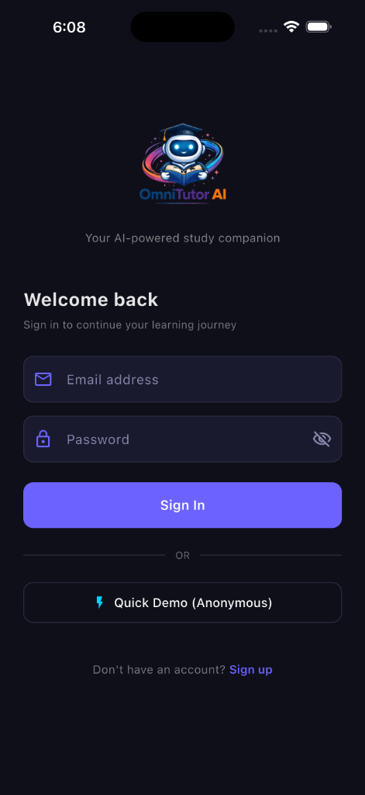
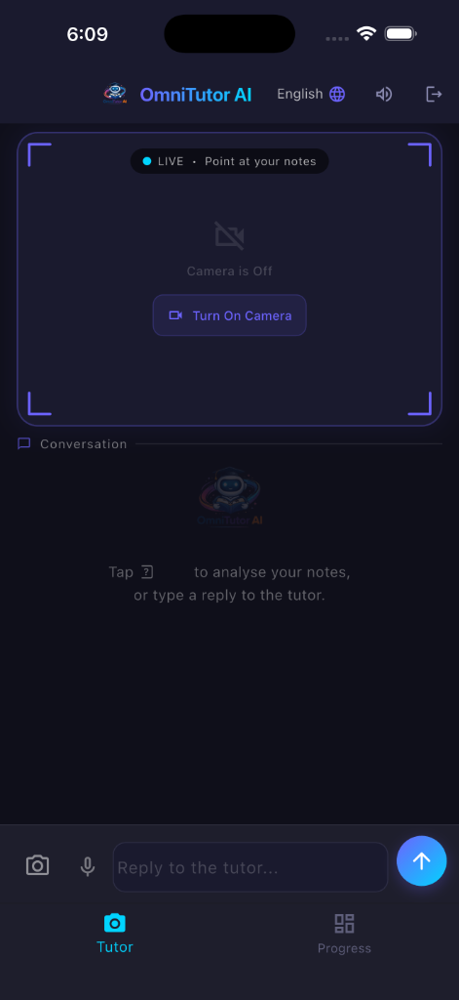
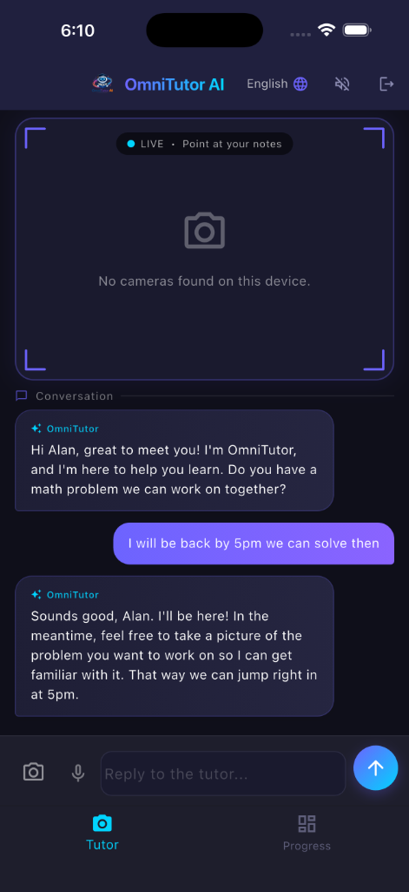

# 🦉 OmniTutor AI

**OmniTutor AI** is a modern, gamified Socratic tutoring application designed to help students master complex problems through curiosity and guided discovery, rather than just getting the right answer.

Powered by **Gemini 2.0 Flash**, OmniTutor acts as a patient mentor that uses the Socratic method—asking guiding questions to lead students to their own "Aha!" moments.

---


## 🚀 Key Features

*   **🧠 Socratic Guiding Logic:** Built-in AI instructions ensure the tutor *never* gives the answer directly.
*   **📷 Multimodal Analysis:** Snap a photo of any problem (math, science, or notes) and the AI analyzes it in real-time.
*   **🔥 Daily Streaks & XP:** A full gamification system with daily streaks and "Brain Points" (XP) tracking.
*   **🎊 Mastery Celebrations:** Real-time confetti animations triggered when the AI detects true conceptual mastery.
*   **🎙️ Voice Interaction:** Integrated Speech-to-Text (STT) and Text-to-Speech (TTS) for hands-free learning.
*   **📊 Progress Dashboard:** Review your session history and track your levels in a sleek, dark-themed UI.
*   **🛡️ On-Demand Camera:** Privacy-focused camera activation to save battery and ensure control.
*   **✨ Professional Feedback:** Smooth shimmer loading states for AI responses.
*   **🏗️ Modular Architecture:** Decoupled services and extracted widgets for peak performance.
*   **🛑 Error Boundaries:** Graceful network and API failure handling with user alerts.

---

## 📱 App Showcase

| Welcome Screen | Tutoring Hub | AI Socratic Chat |
| :---: | :---: | :---: |
|  |  |  |

---

## 🛠 Tech Stack

*   **Frontend:** [Flutter](https://flutter.dev)
*   **AI Engine:** [Google Generative AI (Gemini 2.0 Flash)](https://ai.google.dev/)
*   **Backend:** [Firebase](https://firebase.google.com/) (Authentication & Firestore)
*   **State Management:** Flutter Streams & Hooks

---

## 🚦 Getting Started

### Prerequisites

*   Flutter SDK (^3.5.0)
*   A Google Cloud Project with the **Gemini API** enabled.
*   A Firebase Project with **Firestore** and **Email/Password Auth** enabled.

### 1. Clone the repository
```bash
git clone https://github.com/alansajith/OmniTutor-AI.git
cd OmniTutor-AI
```

### 2. Configure Environment Variables
Create a `.env` file in the root directory and add your Gemini API Key:
```env
GEMINI_API_KEY=your_actual_api_key_here
```

### 3. Setup Firebase
1.  Download your `google-services.json` (Android) and `GoogleService-Info.plist` (iOS) from the Firebase Console.
2.  Place them in the respective folders:
    *   `android/app/google-services.json`
    *   `ios/Runner/GoogleService-Info.plist`

### 4. Install Dependencies
```bash
flutter pub get
```

### 5. Run the App
```bash
flutter run
```

---

## 📖 Socratic Method in Action

OmniTutor follows a strict set of rules:
1. **Never** solve the problem directly.
2. If the student makes an error, ask a question like *"I see you wrote X here — can you walk me through how you got that?"*
3. If the work is correct, ask *"Spot on! What do you think the next logical step is?"*

---

## 🧪 Deployment & Testing

*   **iOS:** Ensure permissions for Camera and Speech are granted in `Info.plist`.
*   **Android:** Ensure `RECORD_AUDIO` and `CAMERA` permissions are in `AndroidManifest.xml`.

---

## 📜 License
This project is for educational purposes. All rights reserved.

*Developed with ❤️ by Alan Sajith & OmniTutor AI.*
